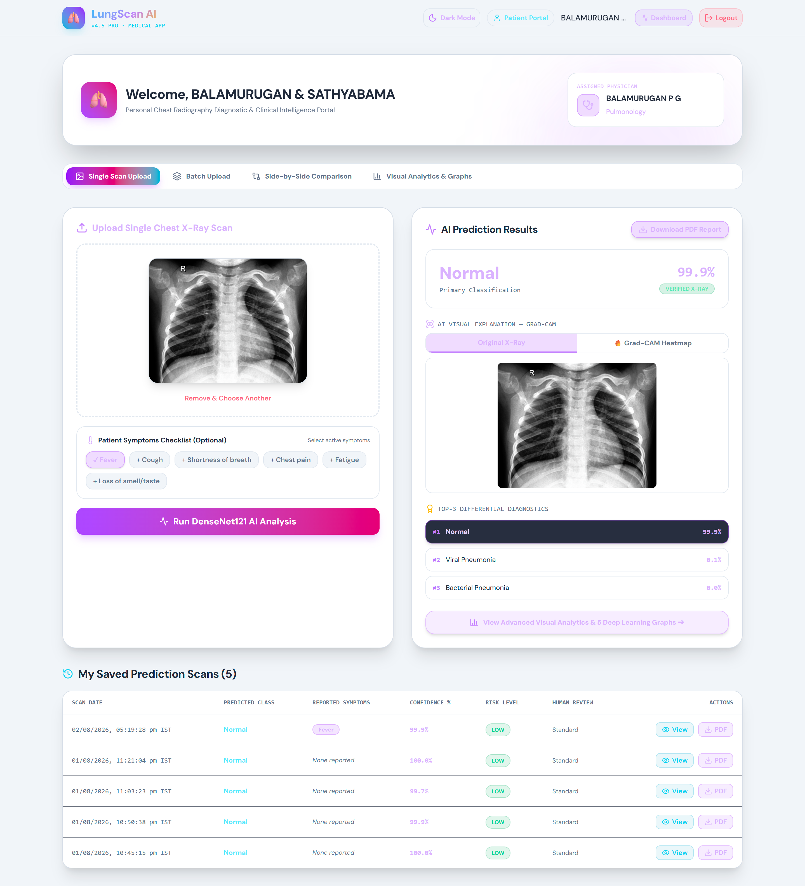
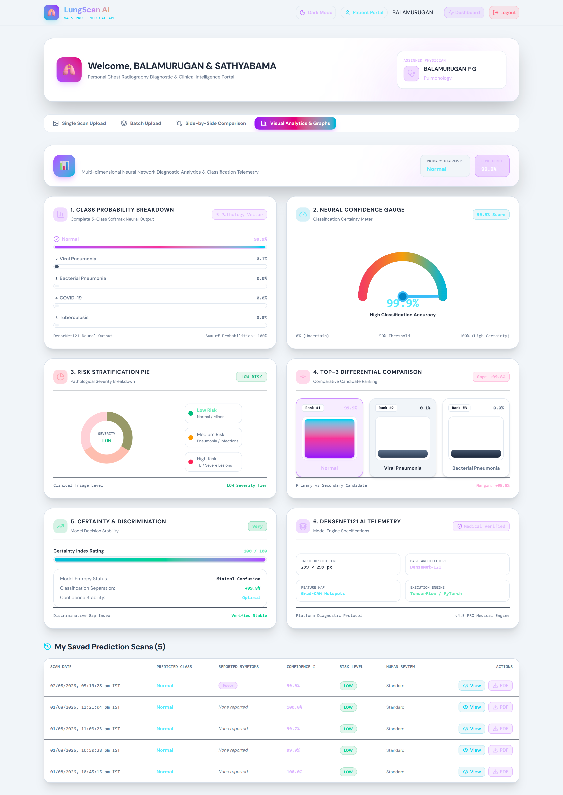
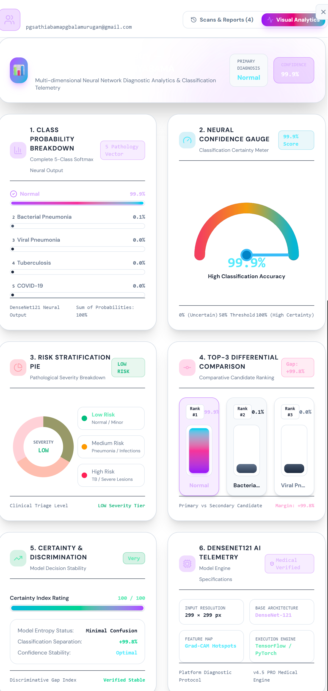

# 🫁 LungScan AI – Multi-Class Chest X-ray Disease Detection


Welcome to **LungScan AI**, a comprehensive, full-stack AI/ML healthcare application designed to detect multiple lung diseases from Chest X-ray images.

This project was built as part of my **AI/ML Technical Training** to demonstrate end-to-end machine learning deployment—from deep learning model creation to building a responsive frontend and a robust backend. 

---

## 🚀 Project Overview

**LungScan AI** leverages a state-of-the-art Convolutional Neural Network (DenseNet121) to analyze chest X-rays and classify them into 5 distinct classes (Normal + 4 disease types). It incorporates **Grad-CAM (Gradient-weighted Class Activation Mapping)** to provide visual explanations of the model's predictions, highlighting the specific regions of the X-ray that influenced the AI's decision. 

The system features a multi-role architecture, separating patient and doctor dashboards with comprehensive analytics, secure authentication, and automated PDF report generation.

### ⚠️ Disclaimer
> **This is a technical training/learning project.** The AI models and predictions provided by this software are for educational and demonstration purposes only. They are **not** a replacement for professional medical advice, diagnosis, or treatment by qualified healthcare professionals.

---

## ✨ Features

- **Multi-Class Disease Detection:** Classifies Chest X-rays using a fine-tuned DenseNet121 model.
- **Explainable AI (XAI):** Uses Grad-CAM to generate heatmaps, providing visual transparency for the AI's predictions.
- **Role-Based Access Control:** Distinct user experiences for **Patients** (viewing their own scans/reports) and **Doctors** (managing multiple patients, analyzing visual analytics).
- **Automated PDF Reports:** Generates downloadable, professional PDF reports combining the original X-ray, Grad-CAM heatmap, and prediction confidence scores.
- **Visual Analytics:** Interactive dashboards displaying scan history, prediction confidence trends, and disease distributions.
- **Secure Authentication & Database:** Powered by Supabase for secure user login and structured data storage.

---

## 🛠️ Tech Stack

### Deep Learning & AI
- **TensorFlow / Keras:** Model building, training, and Grad-CAM implementation.
- **DenseNet121:** Base architecture for robust image feature extraction.
- **NumPy & Pillow (PIL):** Image processing and array manipulation.

### Backend
- **FastAPI:** High-performance RESTful API for handling inference requests, file uploads, and data fetching.
- **Uvicorn:** ASGI server.
- **FPDF2:** Dynamic PDF report generation.

### Frontend & Database
- **React.js:** Dynamic, component-based user interface.
- **Supabase:** PostgreSQL database, authentication, and user management.

---

## 📸 Screenshots & Walkthrough

Here is a look at the various interfaces and features of LungScan AI.

### 1. Login & Registration
Secure authentication portal powered by Supabase.


### 2. Patient Dashboard
A comprehensive view for patients to upload new X-rays, view their scan history, and access reports.


### 3. Patient Visual Analytics
Interactive charts displaying prediction confidence and historical trends for the patient.


### 4. Doctor Dashboard
A unified interface for healthcare professionals to monitor all patient scans and manage records.


### 5. Prediction Results & Scans
Detailed breakdown of a scan, showing the prediction confidence and Grad-CAM heatmap.


### 6. Doctor Visual Analytics
Aggregate analytics for doctors to understand disease distribution across all their patients.


### 7. Automated PDF Report
Sample of the generated PDF report containing the original scan, heatmap, and AI findings.


---

## ⚙️ Installation & Setup

Follow these steps to run the project locally.

### Prerequisites
- Python 3.10+
- Node.js & npm
- A Supabase account (for database and auth)

### 1. Clone the repository
```bash
git clone https://github.com/balamuruganpg/LungScan-AI-Chest-Xray-Detection.git
cd LungScan-AI-Chest-Xray-Detection
```

### 2. Backend Setup (FastAPI)
```bash
# Navigate to the project root
# Create a virtual environment
python -m venv venv

# Activate the virtual environment
# Windows:
venv\Scripts\activate
# Mac/Linux:
source venv/bin/activate

# Install requirements
pip install -r requirements.txt
```

> **Note:** Due to size limits, the trained `.keras` model weights are not included in this repository. Ensure you place your trained model inside the `Models/` directory before starting the backend.

```bash
# Start the FastAPI server
cd app
uvicorn main:app --reload --host 0.0.0.0 --port 8000
```

### 3. Frontend Setup (React)
Open a new terminal window.
```bash
# Navigate to the frontend directory
cd frontend

# Install dependencies
npm install

# Start the development server
npm run dev
```

### 4. Environment Variables
You will need to set up `.env` files for both the backend and frontend with your respective Supabase API URLs and anon keys. (Refer to `.env.example` if available). **Never commit your secret keys!**

---

## 📂 Project Structure

```
LungScan-AI-Chest-Xray-Detection/
│
├── app/                        # FastAPI Backend source code
│   ├── main.py                 # API endpoints
│   ├── model_loader.py         # AI Model loading & inference logic
│   └── ...
│
├── frontend/                   # React Frontend source code
│   ├── src/
│   ├── public/
│   └── package.json
│
├── UI_and_Feautures_ScreenShot/# Screenshots used in this README
├── requirements.txt            # Python dependencies
├── .gitignore                  # Git ignore rules
└── README.md                   # Project documentation
```

---

## 🎓 Learning Outcomes

Through building LungScan AI, I gained practical experience in:
- Training and fine-tuning Deep Learning architectures (DenseNet121) for medical image analysis.
- Implementing **Explainable AI (XAI)** techniques like Grad-CAM to demystify neural network predictions.
- Developing high-performance REST APIs with **FastAPI**.
- Building responsive, multi-role user interfaces using **React**.
- Integrating robust authentication and relational database modeling using **Supabase (PostgreSQL)**.

## 🔮 Future Improvements

- **Expand Disease Classes:** Train the model on larger, more diverse datasets to detect a wider variety of lung conditions.
- **Model Optimization:** Convert the model to TFLite or ONNX for faster inference and edge-device compatibility.
- **Enhanced Doctor Tooling:** Implement features for doctors to annotate X-rays and provide feedback to actively improve model training (Active Learning).

---

### 👨‍💻 Author
**BALAMURUGAN P G**  
📧 balamuruganpg@outlook.com  

*If you found this project interesting, feel free to reach out or explore my other repositories!*
